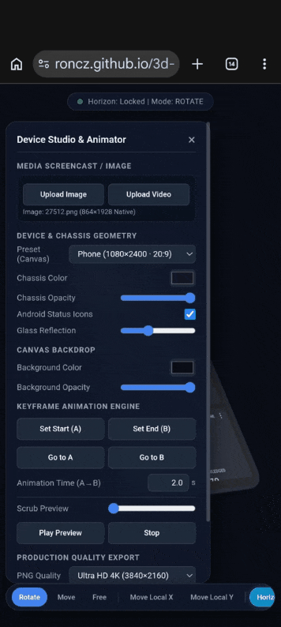

# 3D Mockup Studio

Little AI vibe coding experiment for adding screenshots or screen casts to device mockups and generate images or animations.

Try here:
https://roncz.github.io/3d-mockup/

## 3D Device Mockup Studio & Animation Suite

A standalone, single-file HTML/WebGL application built with Three.js to compose, animate, and export high-resolution 3D device mockups directly in your browser.

---
### Features
- **Geometry Presets:** Procedural chassis models for Modern Phones (20:9), Tablets (16:10 and 3:4), Laptops, and Frameless display panes.
- **Media Screencasts:** Direct GPU texture streaming for custom images and MP4/WebM videos with hardware-accelerated aspect mapping and audio pass-through.
- **Dynamic Overlays:** Vector-rendered Android status bar overlay (Clock, Cellular signal, Wi-Fi, Battery) that stays sharp at extreme resolutions.
- **Material Controls:** Adjustable chassis color, chassis opacity, glass glare/reflection intensity, and canvas background transparency.
- **Keyframe Engine:** Interpolate between two states (**Keyframe A** and **Keyframe B**) with independent motion duration, scrub preview, and easing.
- **Flexible Space Controls:** View-space rotation with Horizon Lock, 2D screen-plane translation, and local 3D chassis sliding.
- **Ultra-HD Production Exports:**
  - **PNG:** Headless offline rendering up to **5K (5120×2880)** with 8× MSAA.
  - **WebM:** Hardware-accelerated 60 FPS recording at 40 Mbps with embedded original screencast audio and automated buffer-drain post-roll to eliminate clipped endings.
---

### Quick Start
1. Open `index.html` in any modern web browser (desktop or mobile).
2. Click **Upload Image** or **Upload Video** to apply content to the screen.
3. Use touch or mouse gestures to position the device.
4. Set keyframes and click **Export Image** or **Export Video**.
---

### Navigation & Controls

#### Bottom Toolbar (HUD)

| Button | Action |
| :--- | :--- |
| **Rotate** | 1-finger / left-click drag to rotate with automatic horizontal (yaw) or vertical (pitch) axis locking. |
| **Move** | 1-finger / left-click drag to translate across screen space with auto-axis locking. |
| **Free** | Unconstrained, diagonal view-space rotation. |
| **Move Local X / Y** | Drags the device along its own physical 3D chassis axes (ideal for slides when tilted). |
| **Horizon Lock** | Keeps the phone upright relative to the horizon plane, preventing unwanted roll. |
| **Center X / Y / Center** | Centers the optical 2D screen silhouette within the viewport. |
| **Fit View** | Automatically reframes camera distance so the device fills the canvas with a 5px safe margin. |
| **Lying / Front / Iso / Reset** | Quick-align view presets. |

#### Gestures
- **1 Finger / Left Mouse:** Active HUD mode action (Rotate, Move, or Local Slide).
- **2 Fingers (Mobile) / Scroll Wheel (Desktop):** Dedicated camera zoom.
- **Middle / Right Mouse Button:** Screen-space pan.
---

#### Exporting
- **PNG Snapshots:** Select your preferred target resolution (**2K**, **4K**, or **5K**) in the side panel and click **Export Image (PNG)**.
- **WebM Video:**
  - If a video screencast is loaded, the exported video duration automatically matches the source video runtime, while 3D keyframe motion follows the configured **Animation Time**.
  - Includes original audio track.
  - Encoded with high-bitrate VP9/Opus at 60 FPS.

## Disclaimer

> **Note:** This project is 100% AI vibe-coded to scratch my own itch. There are rough edges, quirks, and almost certainly bugs. Use it at your own risk.

## Third-Party Libraries
- [Three.js](https://threejs.org/) - Licensed under the [MIT License](https://github.com/mrdoob/three.js/blob/dev/LICENSE)
- [mp4-muxer](https://github.com/vanilagy/mp4-muxer) - Licensed under the [MIT License](https://github.com/vanilagy/mp4-muxer/blob/main/LICENSE)
